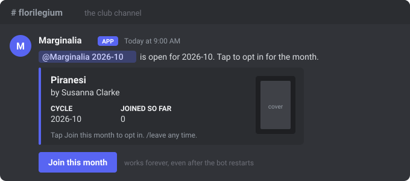
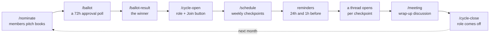
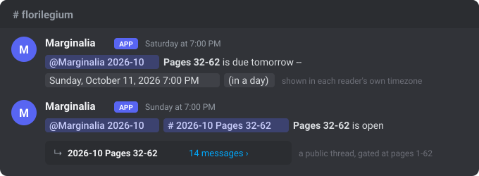
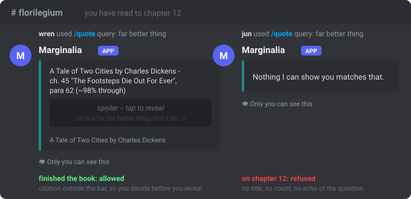
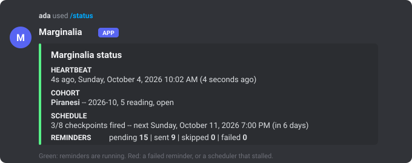

# Marginalia

A book club that runs itself, in one Discord channel.

Every month the members nominate books, a poll picks one, everyone who wants in taps
**Join this month**, and Marginalia posts the reading schedule, the reminders, and a
discussion thread for each checkpoint. Members can quote the book from inside Discord,
and the bot never shows anyone a line past where the club has read.



No LLM, no web scraping, no accounts. One container, one SQLite file, one server.

---

## A month with Marginalia



- **Members** see three things all month: the Join button, the reminders, and the
  threads. Everything else is optional.
- **Organizers** run seven commands in a fixed order. `/help` in Discord lists them.
- **Times are shown in each reader's own timezone**. The bot sends one message with a
  Discord timestamp, and every phone renders it locally.



---

## Commands

Type `/` in the club channel. Every command has a description and every option has a
hint, so this table is the long version.

### For readers

| Command | What it does |
|---|---|
| `/join` `/leave` | Opt in or out of this month. Grants or removes the month's role. No announcement. |
| `/next` | What is due next, when, and a button to its thread. |
| `/progress set` | Record the page or chapter you have reached. Only you see it. |
| `/pace` | How you are doing against the plan. A bar, not a ranking. |
| `/quote` `/passage` | A passage from the book that matches your words, never past what has unlocked for you. Hidden behind a spoiler bar. Add `share: True` to post it publicly. |
| `/find` | Just the citations, no text. Costs nothing from your quote allowance. |
| `/dnf` | Set the book down. Nobody is told. |
| `/library` | Everything the club has read. |
| `/roster` `/mystats` `/nominate` `/help` | Who is in this month, your own numbers, pitch a book for next month, this list. |

### For organizers

Organizer commands are hidden from members. Grant them to a role under
**Server Settings -> Integrations -> Marginalia**, or use them as an administrator.

| Step | Command | Notes |
|---|---|---|
| 0 | `/ingest` | Upload a DRM-free EPUB you own. Enables quoting. The file is deleted after parsing; only the text is kept. Optional. |
| 1 | `/ballot` | Posts the poll from this cycle's nominations. Closes in 72 hours. |
| 2 | `/ballot-result` | Reads the finished poll. A tie is reported as a tie. |
| 3 | `/cycle-open` | In the club channel. Pick the winning nomination (autocomplete) and, if you ingested it, the book. Creates the month's role and posts the Join card. |
| 4 | `/schedule` | `total` pages (or chapters), `weeks`, a weekday from the dropdown, a time. Shows a preview; nothing is written until you press **Create schedule**. Re-run to change it. |
| 5 | `/meeting` | Date and time of the wrap-up. Two reminders. |
| 6 | `/cycle-close` | Ends the month and removes the role from everyone. History is kept. |
| any | `/status` | Is the bot actually scheduling? Green, yellow or red. |
| rare | `/purge_book` | Delete a book's text, index and quote history in one command. |

---

## Quoting without spoiling



- The gate is a SQL `WHERE` clause on the chapter a reader is allowed to see: what the
  schedule has unlocked, capped by their own reported progress. Inside a checkpoint's
  thread the cap is that checkpoint's, forever, so catching up in an old thread never
  leaks forward.
- Replies are visible only to the person who asked. That is the real defence: a public
  message would show the spoiler text raw in a lock-screen notification.
- A refusal carries no title, no match count and no echo of the question, because the
  refusal itself could spoil.
- Quote limits: 75 words per quote, 3 passages per reply, 10 per hour, 40 per day, and
  2% of the book per reader per rolling 30 days. Adjacent ranges are refused for 24
  hours so nobody can walk through a chapter ten paragraphs at a time.

---

## Setup

Three parts: the Discord application, the container, and one drag in your server's
role list. The full, screenshot-level walkthrough is [docs/PORTAL_SETUP.md](docs/PORTAL_SETUP.md).

### 1. Discord Developer Portal

At <https://discord.com/developers/applications>, create an application, then on its **Bot** page:

1. **Reset Token** and copy it. It is shown once. It goes into the container's config and nowhere else.
2. **Privileged Gateway Intents**: turn on **Server Members Intent** and save. Leave Message Content and Presence off.
   Without this the bot connects fine and every roster reads empty, with no error anywhere.
3. **Public Bot**: off.

Then invite it to your server with this link, with your application's ID filled in:

```
https://discord.com/oauth2/authorize?client_id=<APPLICATION_ID>&scope=bot+applications.commands&permissions=17918872005632
```

That number grants exactly: View Channels, Send Messages, Manage Messages, Manage Roles
(labelled "Manage Permissions" in the consent screen), Manage Threads, Create Public
Threads, Send Messages in Threads, Create Events. It does **not** include Mention
Everyone, so Discord itself guarantees the bot can never ping `@everyone`.

Finally, with Developer Mode on (User Settings -> Advanced), right-click your server
icon -> **Copy Server ID**, and right-click the club channel -> **Copy Channel ID**.

### 2. Run the container

Four settings. Everything else has a default.

| Variable | Value |
|---|---|
| `DISCORD_TOKEN` | the token from step 1 |
| `GUILD_ID` | your server's ID |
| `BOOK_CLUB_CHANNEL_ID` | the club channel's ID |
| `CLUB_TZ` | the club's timezone, e.g. `America/Los_Angeles`. `/schedule at:19:00` means 19:00 here. Defaults to `TZ`, then UTC. |

**Unraid** (the setup this repo is deployed on):

```bash
git clone https://github.com/grantnedwards/Marginalia.git /mnt/cache/appdata/marginalia
/mnt/cache/appdata/marginalia/deploy/unraid-install.sh
```

The script builds the image, adds a **marginalia** entry to the Docker tab, installs the
watchdog and daily backup crons, and leaves the container stopped. Open the Docker tab,
**Edit** marginalia, paste the token and the two IDs, **Apply**. Re-run the script after
every `git pull`; it keeps your settings. Details in [deploy/README.md](deploy/README.md).

**Any Docker host**:

```bash
git clone https://github.com/grantnedwards/Marginalia.git && cd Marginalia
docker build -f deploy/Dockerfile -t marginalia .
mkdir -p data && chown 99:100 data
docker run -d --name marginalia --restart unless-stopped --stop-signal SIGINT \
  -e DISCORD_TOKEN=... -e GUILD_ID=... -e BOOK_CLUB_CHANNEL_ID=... -e CLUB_TZ=America/Chicago \
  -e MARGINALIA_DB=/data/marginalia.db -v "$PWD/data:/data" marginalia
```

Or `cd deploy && cp ../.env.example .env`, fill it in, `docker compose up -d --build`.
The `--stop-signal SIGINT` matters: it is what lets the bot close its database cleanly
on `docker stop`.

**Without Docker** (Python 3.13):

```bash
python3 -m venv .venv && .venv/bin/pip install -r requirements.txt
cp .env.example .env    # fill in the four values
.venv/bin/python -m marginalia
```

Keep the database on a real local filesystem. On Unraid that means `/mnt/cache/...`,
never `/mnt/user/...`: SQLite's write-ahead log needs byte-range locking that the FUSE
layer does not provide, and the result is a silently corrupted database weeks later.

### 3. First run in Discord

1. `docker logs -f marginalia` should end in one line naming the bot and the server.
   A bad token, a missing intent, or a wrong server ID each print one plain sentence
   saying what to fix.
2. Type `/` in the club channel. All 23 commands appear immediately.
3. **Server Settings -> Roles: drag Marginalia's role above the `Marginalia YYYY-MM` roles
   it will create.** Discord only lets a bot manage roles below its own, and the error it
   gives when this is wrong is a bare "Missing Permissions". This one step is the cause
   of nearly every 403 anyone hits with this bot.
4. `/help`, then `/cycle-open`.

---

## Operating it



- **`/status`** is the check that matters. A bot can stay connected and answer commands
  while its scheduler has died; the heartbeat row in the database is what tells them apart.
- **Watchdog** ([deploy/watchdog.sh](deploy/watchdog.sh)): every 5 minutes, reads that
  heartbeat read-only and restarts the container if it is over 10 minutes stale. It leaves
  a deliberately stopped container alone.
- **Backups** ([deploy/backup.sh](deploy/backup.sh)): a consistent `sqlite3 .backup`
  snapshot daily, integrity-checked, 30 kept. Restore = stop the container, copy the
  snapshot over `data/marginalia.db`, delete the `-wal` and `-shm` files, start.
- **Reminders are rows, not timers.** A restart, a crash, or a week of downtime never
  loses one: a checkpoint unlock that came due while the bot was down fires when it comes
  back. "Due in an hour" reminders expire instead, because sending them late would be a lie.
- **Exit codes** from `docker logs`: 2 missing config, 3 database cannot be opened,
  4 token rejected, 5 Server Members intent not enabled, 6 wrong server ID or missing
  `applications.commands` scope.

### Troubleshooting

| Symptom | Cause | Fix |
|---|---|---|
| `/join` fails with "I could not change that role" | Bot's role sits below the cohort role | Server Settings -> Roles, drag Marginalia up |
| No commands appear when typing `/` | Wrong `GUILD_ID`, or invite lacked `applications.commands` | Re-copy the server ID, re-invite with the link above |
| `/roster` says nobody, `/cycle-close` strips nobody | Server Members Intent off | Portal -> Bot -> enable, Save, restart the bot |
| A role ping renders blue but nobody is notified | Interaction replies parse users only | Already handled: only `/cycle-open` and reminders ping, with explicit role mentions |
| `/cycle-open` refuses in the channel you use | `BOOK_CLUB_CHANNEL_ID` points elsewhere | Re-copy the channel ID |
| Quoting always says nothing matches | No EPUB ingested, or the cycle was opened without `book:` | `/ingest`, then `/cycle-open ... book:` (re-run `/schedule` afterwards) |
| `/status` is red with a stale heartbeat | The scheduler task died | The watchdog restarts it within 10 minutes; check `docker logs` for the cause |

---

## Development

```bash
python3 -m venv .venv && .venv/bin/pip install -r requirements-dev.txt
.venv/bin/python -m pytest -q      # 208 tests, no token, no network
.venv/bin/ruff check marginalia tests
```

```
marginalia/
  timefmt.py   Discord timestamps and DST-safe weekly dates   (no discord import)
  schedule.py  pure checkpoint planning and pace              (no discord import)
  db.py        aiosqlite, pragmas, migrations; schema.sql + migrations/
  epub.py      EPUB -> chapters and paragraphs
  library.py   ingest, FTS5 search, THE spoiler gate, quote budget
  cycle.py     months, cohorts, membership, nominations, ballots
  progress.py  applying a plan, the meeting, thread unlock, member progress
  reminders.py the durable poller: claim, deliver, reap, heartbeat
  bot.py       the client, intents, command sync, the 30s loop
  cogs/        club.py, reading.py, quote.py: Discord surface only; _views.py: every embed
```

Cogs turn an Interaction into arguments and call the modules above, which is why the
whole suite runs offline. `library.py` is the only module allowed to name the book-text
tables, and a test enforces that by reading the AST. Design rationale, measured
discord.py facts and the schema are in [docs/](docs/): [SPEC.md](docs/SPEC.md),
[ENV.md](docs/ENV.md), [HANDOFF.md](docs/HANDOFF.md), and an illustrated tour of every
message the bot sends in [docs/site/index.html](docs/site/index.html).
